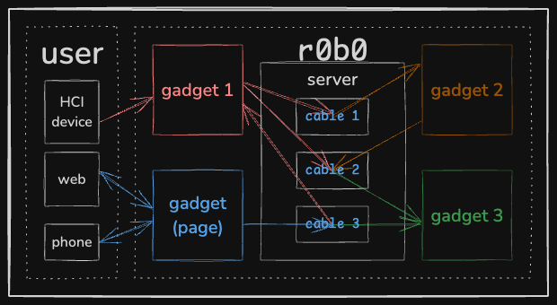
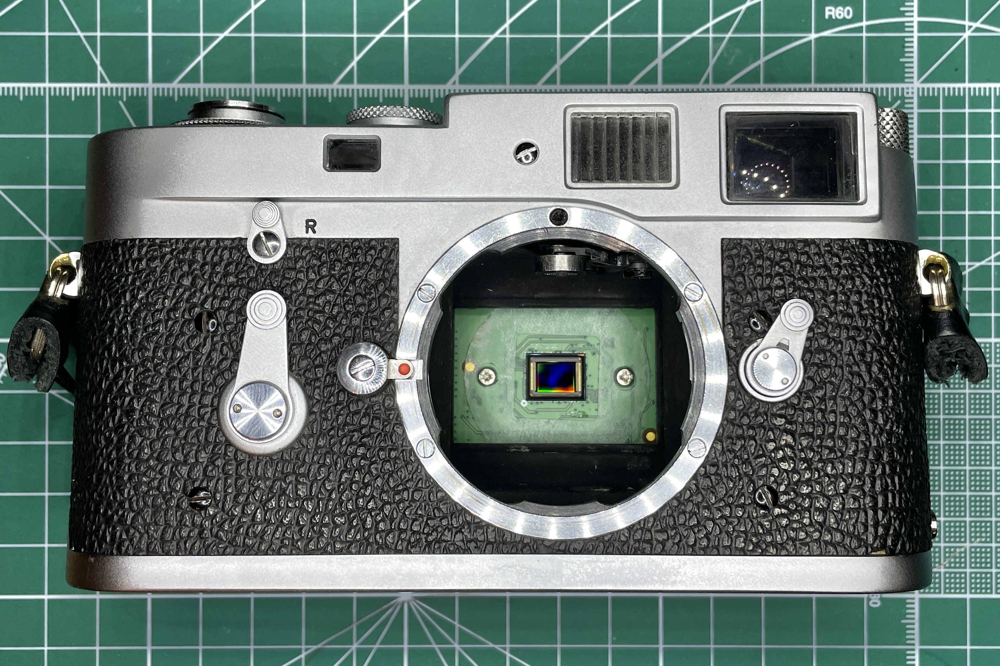

# `r0b0`


*Example of `r0b0` network of gadgets.*

r0b0 is a communication library for connecting hardware and software — an [`aconnect`](https://man.archlinux.org/man/aconnect.1.en) for anything.
The system is a general-purpose tool for quickly prototyping mechatronic systems with a bend towards creative applications.

## Design rationale
`r0b0` started as a refactor of the control software for [Blossom, the open-source robot platform that I developed during my PhD](https://msgtn.xyz/research).
Other existing robot-/mechatronic-oriented communication frameworks are very heavy and geared towards technical applications.
Some design goals:
- Parity with Blossom's functionality by the last subproject of my PhD: remote motion-based telepresence.
- Portability: like Blossom's codebase which ran identically on any UNIX-based system, `r0b0` should be easy to set up and run whether on a macOS laptop or Raspberry Pi.
- Extensibility and modularity: the structure is based on devices (Gadgets) that communicate among each other through messaging functions (Cables) in networked groups (Rigs). Components should be ignorant of each other to enable ease of modification.

## Example Rigs
I've used `r0b0` to power not just Blossom, but also other non-robotic platforms.
I am currently (231223) refactoring the package to start rigs from scripts instead of config`.yaml`s, in a more Pythonic / functional interface. 
Examples will be stored in [`examples/`](./examples/)


### Blossom


[Blossom is an open-source robot for human-robot interaction research](https://msgtn.xyz/research).
This repo was created for a [rebuild of the platform](https://msgtn.xyz/rebuild_of_blossom).
Blossom-specific documentation is available [here](./docs/blsm.md).

### Leica MPi


The [Leica MPi is a Raspberry Pi-powered digital back for a Leica M2 film camera](https://msgtn.xyz/mpi).
The hardware includes a Raspberry Pi Zero as the main board, the Raspberry Pi HQ Camera Module as the digital sensor, and an LCD module with buttons as an interface.
This Rig uses two Gadgets:
- A `PiButton` Gadget for the buttons on the LCD module and the shutter sync cable. The sync cable connects the flash sync socket to a GPIO pin on the Pi; pressing the mechanical shutter closes the flash sync socket as if it were a physical button.
- A `PiCamera` Gadget for the camera module.

Cables between the Gadgets handle:
- Using the flash sync socket as a `PiButton` to begin an exposure with the `PiCamera`'s electronic shutter.
- Using the `PiButton`'s physical buttons to control the `PiCamera` settings, e.g. shutter speed.

### Joystick-controlled mouse
I was born too early to actualize my true calling as a giant robot pilot.
Controlling my computer's mouse with a consumer-grade gaming joystick is a close simulation.
This Rig uses two Gadgets:
- A `PyGameJoystick` Gadget to handle events from the physical joystick. On a technical note, the use of `pygame` alters the behavior of the Rig's event loop, which (is/will be) explained in the Rig's README.
- A `Mouse` Gadget to control the software mouse, including motion and button press/release/click.

Cables between the Gadgets handle:
- Mapping `PyGameJoystick` absolute position `Mouse` relative motion.
- Mapping `PyGameJoystick` button presses to `Mouse` left/middle/right presses/releases/clicks.

### Robot Death Star Lamp
A [motorized IKEA PS2014 lamp](https://msgtn.xyz/ps2014).


## Structure

This section provides a brief overview of the structure.
More technical and implementation information is available on the respective READMEs in each module.

The main structural metaphor comes from connecting musical instruments, either through MIDI cables or direct audio inputs and outputs.


### Gadgets
Gadgets are individual hardware devices or software services, e.g. motors and joysticks (hardware), emulated mice and key presses (software).
Gadgets can exist as standalone objects, e.g. a single motor controlled manually through the command line.
Gadgets also exist as nodes in a network of other Gadgets, transmitting and receiving messages through Cables.
Gadget docs are [here](/r0b0/gadgets/README.md).

### Cables
Cables are connections that translate between Gadgets.
For example, a `midi2motor` Cable could translate incoming MIDI messages from the turning of a MIDI controller knob into the outgoing motor position message to the actuation of a robot's motor.
Cables are small, lightweight functions that abstract Gadgets from each other, preserving the system's modularity.
Defining Cables is where most domain knowledge/personal taste comes in.
Cable docs are [here](/r0b0/cables//README.md).

### Rigs
Rigs are networks of Gadgets connected by Cables; they essentially represent the entire system/project.
Rigs manage the connections and higher-level functionalities required to use the system.
Rigs are largely static wrappers that should not need much modification on a case-by-case basis.

## Setup
The package can be installed through PyPi with `pip3 install r0b0-io`, but will be updated infrequently.
It is best to install from this source.

### Install
Clone this repo and pull the submodules
```
git clone https://github.com/psychomugs/r0b0
cd r0b0
git submodule update --init --recursive
```

### Environment setup
Create a Python virtual environment (`venv`) and install from the `pyproject.toml`.
This has been tested on `python3.10.12`.
```
python3 -m venv venv
source venv/bin/activate
pip3 install .
```

Some gadgets like mouse and MIDI controllers require additional dependencies. 
These can be installed with `pip`, e.g. `pip3 install requirements/mouse.txt`.
## Setup
### Install
Clone this repo and pull the submodules
```
git clone https://github.com/psychomugs/r0b0
git submodule update --init --recursive
```

### Environment setup
Set up [conda](https://conda.io), then set up a conda environment and install some other dependencies with `pip` (because of issues with [`mouse`](https://github.com/boppreh/mouse/issues/75)). Docker maybe coming soon (maybe).
```
conda env create `r0b0` -f env.yaml
conda activate r0b0
pip3 install -r req.txt 
```
