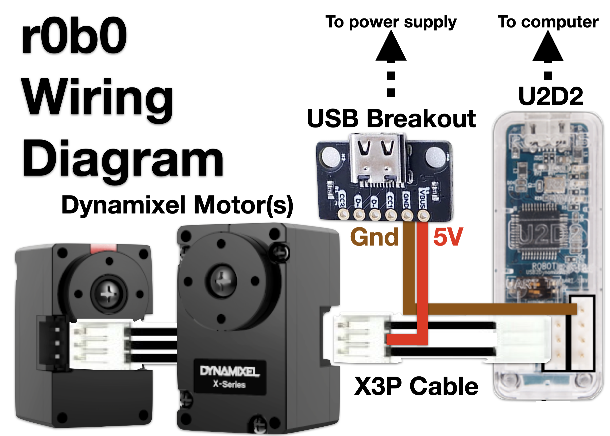

# Wiring
TODO - add image of actual board prototyped

The smallest Dynamixel servos (XL330) can now run at 5V, but the U2D2 interface does not provide power.
To simplify cabling to the motors, we can wire the communication and power connections in parallel.
Wiring these connectors make it easy to reuse the same connectors for different motors or robots.

## Requirements
### Materials

| Name | Approx. cost (USD) | Link |
| ---- | ---- | ---- |
| Dynamixel U2D2 controller | $35 | https://www.robotis.us/u2d2/ |
| Dynamixel XL330 motors | $25 | https://www.robotis.us/dynamixel-xl330-m288-t/ |
| Dynamixel X3P cable (spares) | $20 | https://www.robotis.us/robot-cable-x3p-180mm-10pcs/ |
| USB breakout | $7 | https://www.amazon.com/Treedix-Type-C-Breakout-Connector-Converter/dp/B096M2HQLK |
| Male-Female and Male-Male wires | $7  |  https://www.amazon.com/Elegoo-EL-CP-004-Multicolored-Breadboard-arduino/dp/B01EV70C78/ | 
| USB cable and charger | -- | Assuming you have these laying around your house. If not, check if they've been eaten by the couch |

The USB breakout can be swapped with anything that can connect to 5V, I just try to run most projects from 5V supplies to take advantage of the ubiquity of USB chargers and ports.

### Tools & skills
The process is *almost* solderless, save for the wiring of the USB breakout.

## Instructions

On one end of a Dynamixel X3P cable, remove the center pin by prying up on the locking tab (a narrow screwdriver or wire cutters would work well) — this is the power line, and we will route it to the external supply.
Connect this side of the Dynamixel cable to the TTL pins (center row) on the U2D2.

Using a male-male wire, connect the X3P cable's loose center pin wire to the positive voltage pin on the USB breakout board (red line in figure).
Using a male-female wire, connect the ground from the power supply to a spare ground pin of the U2D2, the topmost pin on the RS485 pins (brown line in figure).
You may have to remove the wire's black plastic 'sleeve' to fit on the pin.
Solder the wires to the breakout board.

Connect the leading end of the Dynamixel cable to the Dynamixel XL330, and connect successive motors with X3P cables (this is called 'daisy chaining').
Connect the USB breakout to a power supply, e.g. a wall outlet.
The motor LED should blink to indicate that it is receiving power.
Connect the U2D2 to the control computer.
You *could* also power the motors from the computer, but this has not been extensively tested for safety.

## Notes
- Connect all motors before supplying power.